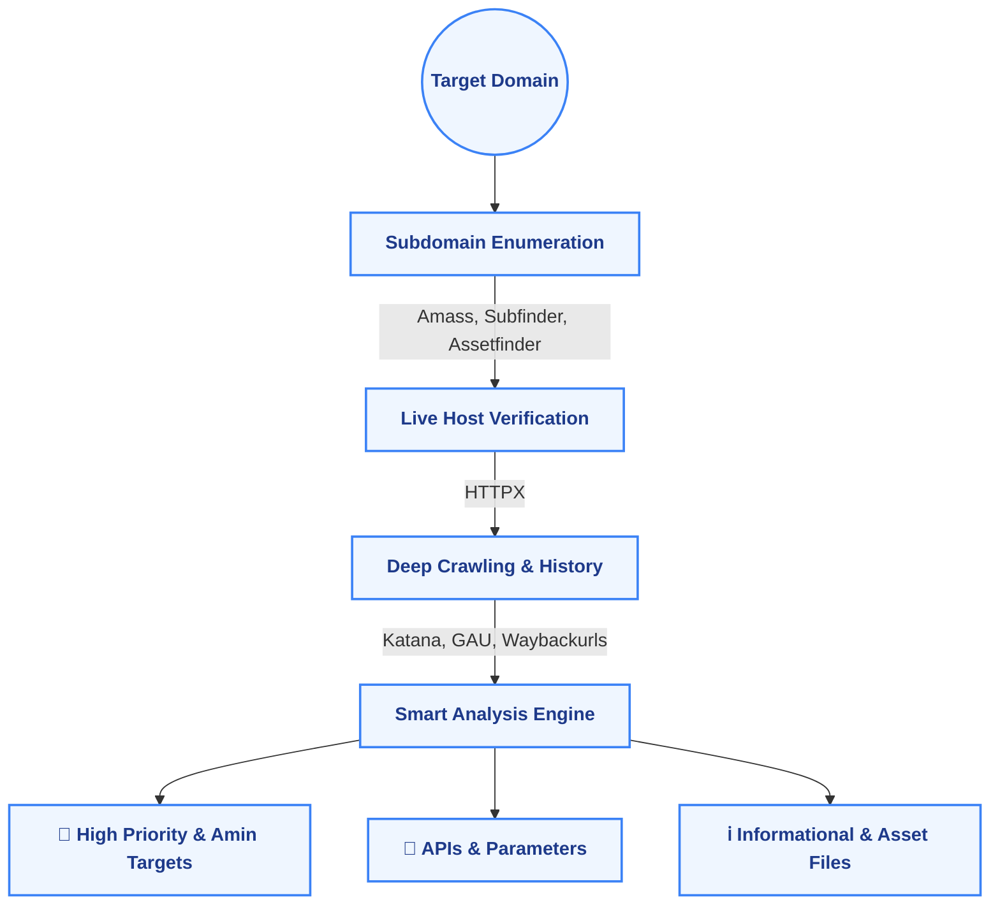

<div align="center">
  <br />
  
  <h1>E A S Y R E C O N</h1>
  <p><strong>The recon command you run before anything else.</strong></p>

  <p>
    
    
    
  </p>


</div>


> **Stop wasting the first hour of every engagement setting up your tools.**  
> `easyrecon` strips away the friction. Run one command, get a perfectly categorized attack surface, and jump straight into hunting. 

<br />

##  The Crucial Question: Why *Must* You Use EasyRecon?

Most hunters waste hours running tools one by one, manually filtering out dead domains, and losing track of juicy endpoints in massive text files. **EasyRecon completely eliminates this bottleneck.** 

<br />

<table width="100%">
  <tr>
    <th width="50%" align="center" style="font-size: 1.2em; color: #ef4444;">❌ The Old Way (Manual)</th>
    <th width="50%" align="center" style="font-size: 1.2em; color: #10b981;">✅ The EasyRecon Way</th>
  </tr>
  <tr>
    <td valign="top">
      <ul>
        <li>Run `subfinder`, wait to finish</li>
        <li>Run `amass`, wait to finish</li>
        <li>Manually concatenate and `sort -u`</li>
        <li>Run `httpx` to find live hosts</li>
        <li>Run `gau` & `waybackurls`</li>
        <li>Get a 5GB text file of random URLs</li>
        <li>Spend 2 hours searching for `?id=` or `/admin`</li>
      </ul>
    </td>
    <td valign="top">
      <ul>
        <li>Run `easyrecon target.com`</li>
        <li>Go grab a cup of coffee ☕</li>
        <li>Return to a fully weaponized, neatly categorized workspace</li>
        <li>Instantly open the `high-priority-admin.txt` vault</li>
        <li><strong>Start hacking immediately</strong></li>
      </ul>
    </td>
  </tr>
</table>

<br />

##  Every Benefit, Broken Down

<table width="100%">
  <tr>
    <td width="50%" valign="top">
      <h3> Unmatched Speed</h3>
      <p>By leveraging intelligent multi-threading and asynchronous orchestration, we run industry-standard tools in parallel. What used to take hours now takes minutes. You are always the first to start testing on new targets.</p>
    </td>
    <td width="50%" valign="top">
      <h3> Smart Categorization</h3>
      <p>EasyRecon doesn't just dump raw data. It analyzes every single URL and categorizes them into actionable buckets: APIs, Admin Panels, Sensitive Exposures, and Injectable Parameters.</p>
    </td>
  </tr>
  <tr>
    <td width="50%" valign="top">
      <h3> Zero Blind Spots</h3>
      <p>By overlapping capabilities of 7+ premier security tools (Subfinder, Amass, Katana, GAU, HTTPX, etc.), we ensure that if an endpoint exists, EasyRecon will find it. Maximum coverage guaranteed.</p>
    </td>
    <td width="50%" valign="top">
      <h3> Highly Customizable</h3>
      <p>Want to add your own secret internal tool? EasyRecon's modular architecture lets you hook in custom scripts and binaries natively through a simple YAML configuration.</p>
    </td>
  </tr>
</table>

<br />

##  The Orchestration Pipeline

Visualizing the automated magic:



<br />

##  Contextual Outcomes

Once setup and scanning are finished, `easyrecon` delivers precisely what you need, neatly organized. Focus on what matters:

* 🚨 **`/results/target.com/admin_panels.txt`** — Direct links to login gates.
* 🔑 **`/results/target.com/secrets_and_config.txt`** — `.env`, `.git`, configurations.
* 🔌 **`/results/target.com/api_endpoints.txt`** — Undocumented GraphQL / REST endpoints.
* 💉 **`/results/target.com/injectable_parameters.txt`** — URLs ready for XSS, SQLi, and SSRF payloads.

<br />

##  Quick Start

### 1. Requirements
* Python 3.8+
* Go *(needed to easily grab the underlying tools)*

### 2. Install
```bash
git clone https://github.com/unrealsrabon/easyrecon
cd easyrecon
chmod +x install.sh
./install.sh
```

### 3. Usage & Examples
```bash
# Kick off a full orchestration
easyrecon target.com

# Go aggressive with threads
easyrecon target.com --threads 100 --output ~/bugbounty_vault

# Run only specific modules 
easyrecon target.com --phase enum

# For help
easyrecon --help
```

<br />

##  Legal & License

**Disclaimer:** Only point `easyrecon` at assets you own or possess explicit, written permission to test. Unauthorized scanning is actionable and illegal.

Released under the **MIT License**.  
Crafted by [@unrealsrabon](https://github.com/unrealsrabon) — part of the *ai-will-replace-developers* initiative.
