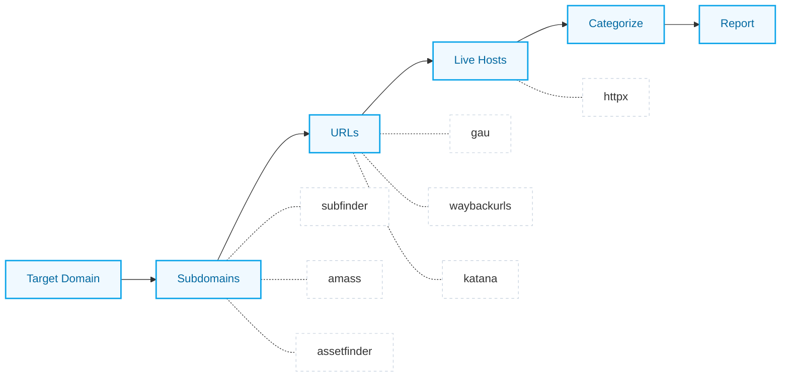

<div align="center">
  <br />
  
  <h1>E A S Y R E C O N</h1>
  <p><strong>The recon command you run before anything else.</strong></p>

  <p>
    
    
    
  </p>


</div>

<br />

> **Recon shouldn't feel like rebuilding your workflow for every new target.**  
> Run one command. Handle the heavy setup. Jump straight into testing. `easyrecon` strips away the friction.

<br />

##  Why this belongs in your toolkit

<table width="100%">
  <tr>
    <td width="33%" align="center" valign="top">
      <br />
      <br />
      <br />
      <strong>Instant Start</strong><br />
      <span style="color:#64748b;">No more manual tool configurations or chaining scripts before every engagement.</span>
      <br /><br />
    </td>
    <td width="33%" align="center" valign="top">
      <br />
      <br />
      <br />
      <strong>Broader Coverage</strong><br />
      <span style="color:#64748b;">Runs multiple trusted tools in parallel, then cleanly merges and deduplicates output.</span>
      <br /><br />
    </td>
    <td width="33%" align="center" valign="top">
      <br />
      <br />
      <br />
      <strong>Pristine Output</strong><br />
      <span style="color:#64748b;">Get beautifully organized directories and a formatted report, not a chaotic text dump.</span>
      <br /><br />
    </td>
  </tr>
</table>

<br />

##  The Pipeline

What exactly happens when you run `easyrecon target.com`:



<br />

##  Smart Categorization

Instead of combing through monolithic text files, `easyrecon` automatically buckets your targets so you know exactly where to strike first.

| Priority | Category | Match Signatures |
| :--- | :--- | :--- |
|  **High** | `sensitive` | `.git`, `.env`, backup directories, `/config`, `/actuator` |
|  **High** | `admin` | `/admin`, `/panel`, `/dashboard`, control interfaces |
|  **High** | `login` | `/login`, `/auth`, `/sso`, `/wp-admin` |
|  **Med** | `api` | `/api`, `/v1`, `/graphql`, `/swagger` |
|  **Med** | `params` | URLs exposing testable parameters (`?id=`, `?url=`) |
|  **Med** | `upload` | File endpoints, `/import`, `/media` |
|  **Info** | `js` `json` `php` | Technology-specific endpoint groups |

<br />

##  Quick Start

### 1. Requirements
* Python 3.8+
* Go *(required for automated tool installation)*

### 2. Install
```bash
git clone https://github.com/unrealsrabon/easyrecon
cd easyrecon
chmod +x install.sh
./install.sh
```
*The setup script automatically resolves missing Python dependencies and fetches required Go binaries.*

### 3. Usage
```bash
# Kick off a full orchestration
easyrecon target.com

# Focus on a specific phase
easyrecon target.com --phase subdomain

# Customize the execution
easyrecon target.com --timeout 60 --output ~/recon-results
```

<br />

##  Configuration

Tailor `easyrecon` perfectly to your environment by mapping out a `~/.easyrecon.yaml`:

```yaml
tools:
  amass:
    enabled: false             # Skip heavy execution
  subfinder:
    timeout: 60                # Cap runtime limit
    extra_args: "-recursive"   # Feed custom flags

settings:
  output_dir: "~/results"
  threads: 50
  auto_install: true
```

<br />

##  Legal & License

**Disclaimer:** Only point `easyrecon` at assets you own or possess explicit, written permission to test. Unauthorized scanning is actionable and illegal.

Released under the **MIT License**.  
Crafted by [@unrealsrabon](https://github.com/unrealsrabon) — part of the *ai-will-replace-developers* initiative.
