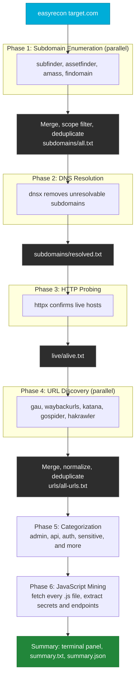

<div align="center">


```
 ___  __ _ ___ _   _ _ __ ___  ___ ___  _ __
/ _ \/ _` / __| | | | '__/ _ \/ __/ _ \| '_ \
|  __/ (_| \__ \ |_| | | |  __/ (_| (_) | | | |
\___|\__,_|___/\__, |_|  \___|\___\___/|_| |_|
                |___/   reconnaissance framework
```

# easyrecon

**One command turns a domain into a fully mapped, categorized attack surface.**

`easyrecon target.com`, and the industry-standard recon toolchain runs for you, in parallel, with the output already organized for hunting.

<br>


</div>

---

##  A rebuilt version, not an update

easyrecon began as a Python tool. It worked, but it had a ceiling: Python's threading model does not give true parallel execution for this kind of workload, startup time added up across every run, and distributing it meant asking every user to manage a Python environment and a list of pip dependencies before they could run a single scan.

This version is a full rewrite in Go. The feature set and philosophy carry over, one command, fully categorized output, but the foundation underneath it is different in ways that directly affect how it performs on a real engagement.

<table>
<tr>
<th align="left" width="20%">Area</th>
<th align="left" width="40%">Python version (legacy)</th>
<th align="left" width="40%">Go version (current)</th>
</tr>
<tr valign="top">
<td><b>Distribution</b></td>
<td>Requires Python 3.8 or newer, a virtual environment, and installed pip dependencies before first use</td>
<td>Ships as a single compiled binary. No interpreter, no dependency installation, no environment to manage</td>
</tr>
<tr valign="top">
<td><b>Concurrency</b></td>
<td>Threaded, constrained by Python's global interpreter lock during CPU-bound work</td>
<td>Runs tools as true concurrent processes using goroutines, with real parallel execution across CPU cores</td>
</tr>
<tr valign="top">
<td><b>Startup and runtime</b></td>
<td>Interpreter startup and library import overhead on every invocation</td>
<td>Starts immediately as native compiled code</td>
</tr>
<tr valign="top">
<td><b>Tool integration</b></td>
<td>Fixed set of phases, extending the tool list meant editing the source</td>
<td>Fully config driven through a YAML file, new tools are added without touching any code</td>
</tr>
<tr valign="top">
<td><b>URL deduplication</b></td>
<td>Basic sort and unique operation on raw URL text</td>
<td>Normalizes host case, default ports, query parameter order, and trailing slashes before deduplicating, so equivalent URLs are correctly merged</td>
</tr>
<tr valign="top">
<td><b>JavaScript analysis</b></td>
<td>Listed discovered JavaScript file URLs</td>
<td>Fetches JavaScript file contents directly and scans them for embedded secrets and hidden API endpoints</td>
</tr>
<tr valign="top">
<td><b>Interrupt handling</b></td>
<td>Standard process termination</td>
<td>Terminates the full process tree on interrupt, writes results atomically, and preserves partial output</td>
</tr>
</table>

The result is a tool that starts faster, uses genuine parallelism instead of simulated concurrency, and installs as one file instead of a dependency chain. This is the version recommended for all new use. The Python release remains archived for reference only and is no longer maintained.

---

##  What it does

Reconnaissance against a target typically means running a series of tools by hand: subdomain enumeration, DNS resolution, live host probing, URL discovery from multiple sources, and then manually sorting the results to find anything worth investigating. Done manually, this takes an hour or more and is easy to get inconsistent between targets.

easyrecon runs that entire sequence as a single pipeline. Tools within each stage run in parallel, results are merged and deduplicated between stages, and the final output is already sorted into categories such as admin panels, API endpoints, authentication flows, and exposed configuration files. The result is a folder that is ready to work from the moment the scan finishes.

---

##  Pipeline

easyrecon executes as a sequence of phases. Every tool inside a phase runs concurrently, bounded by a configurable concurrency limit. Between phases, results are merged, normalized, filtered to scope, and deduplicated before being passed to the next stage.


```mermaid
flowchart TD
    A["easyrecon target.com"] --> B
    subgraph P1["Phase 1: Subdomain Enumeration (parallel)"]
        B["subfinder, assetfinder, amass, findomain"]
    end
    B --> C["Merge, scope filter, deduplicate<br/>subdomains/all.txt"]
    C --> D
    subgraph P2["Phase 2: DNS Resolution"]
        D["dnsx removes unresolvable subdomains"]
    end
    D --> E["subdomains/resolved.txt"]
    E --> F
    subgraph P3["Phase 3: HTTP Probing"]
        F["httpx confirms live hosts"]
    end
    F --> G["live/alive.txt"]
    G --> H
    subgraph P4["Phase 4: URL Discovery (parallel)"]
        H["gau, waybackurls, katana, gospider, hakrawler"]
    end
    H --> I["Merge, normalize, deduplicate<br/>urls/all-urls.txt"]
    I --> J["Phase 5: Categorization<br/>admin, api, auth, sensitive, and more"]
    J --> K["Phase 6: JavaScript Mining<br/>fetch every .js file, extract secrets and endpoints"]
    K --> L["Summary: terminal panel, summary.txt, summary.json"]
    style A fill:#00ADD8,stroke:#007d9c,color:#fff
    style L fill:#22863a,stroke:#176f2c,color:#fff
    style C fill:#2d2d2d,stroke:#555,color:#fff
    style E fill:#2d2d2d,stroke:#555,color:#fff
    style G fill:#2d2d2d,stroke:#555,color:#fff
    style I fill:#2d2d2d,stroke:#555,color:#fff
```

A few properties of the pipeline are worth calling out:

- **Parallel within a phase.** All four subdomain tools run at the same time. All five URL discovery tools run at the same time. No stage waits on another tool that could be running concurrently.
- **Deduplication that understands URLs.** Rather than a plain text sort, URLs are normalized first: hosts are lowercased, default ports are stripped, query parameters are sorted, and fragments are trimmed. Two URLs that differ only in formatting are correctly recognized as one.
- **Scope filtering.** Passive sources occasionally return out-of-scope hosts. These are filtered out before further processing so scans stay within the intended target.
- **Fault tolerant.** If a tool times out or fails, its partial output is preserved and the pipeline continues. A tool that is not installed is skipped rather than treated as an error.

---

##  Output structure

Every scan produces a single, predictable folder layout:

```
results/target.com/
├── summary.txt              overview of counts and file locations
├── summary.json             the same summary in machine readable form
│
├── subdomains/
│   ├── all.txt               every unique subdomain found, in scope
│   └── resolved.txt          the subset that resolves in DNS
│
├── live/
│   ├── alive.txt             live URLs with scheme
│   └── hosts.txt             live hostnames only
│
├── urls/
│   ├── all-urls.txt          every unique URL found, normalized
│   └── categorized/
│       ├── sensitive.txt     exposed .env, .git, backups, keys, configs
│       ├── admin.txt         admin panels and management dashboards
│       ├── auth.txt          login, oauth, sso, and password reset flows
│       ├── api.txt           REST, GraphQL, and documented API endpoints
│       ├── upload.txt        file upload and media endpoints
│       ├── docs-debug.txt    actuator, phpinfo, debug, and metrics endpoints
│       ├── suspicious.txt    parameters that suggest redirect, SSRF, or LFI risk
│       ├── params.txt        URLs carrying query parameters, useful for fuzzing
│       └── js.txt            every discovered JavaScript file
│
├── js/
│   ├── js-urls.txt           JavaScript files selected for content analysis
│   ├── secrets.txt           credentials and tokens found inside JavaScript
│   └── endpoints.txt         API paths extracted from JavaScript source
│
├── raw/                      unmodified output from each individual tool
│   ├── subs/  urls/  js/  misc/
│
└── logs/                     per-tool execution logs
```

Nothing needs to be located manually, and nothing needs to be re-deduplicated by hand. The `sensitive.txt` and `js/secrets.txt` files are typically the first two worth opening.

---

##  JavaScript mining

Modern applications routinely embed information in their JavaScript that is not visible anywhere else: internal API paths, staging URLs, and occasionally hardcoded credentials that were never meant to ship to a browser.

easyrecon fetches every discovered JavaScript file directly, subject to concurrency limits, timeouts, and a size cap, and scans the actual file contents rather than just listing the URLs. It looks for two categories of findings:

- **Secrets.** Sixteen high-confidence patterns covering AWS keys, Google API keys, Slack tokens and webhooks, GitHub and GitLab tokens, Stripe keys, JWTs, private key blocks, Twilio, SendGrid, Mailgun, Firebase URLs, and a generic API key pattern. The pattern set is tuned for signal over volume.
- **Endpoints.** Paths and full URLs referenced in the code that would not appear in any crawler's output because they are only constructed at runtime.

If the dedicated JavaScript discovery tool finds nothing, easyrecon falls back to every JavaScript file already discovered during URL enumeration, so this stage still produces results even when that tool comes up empty. Like the rest of the pipeline, JavaScript mining is best-effort: if it fails for any reason, the core recon results already written to disk are unaffected.

---

##  Installation

### From the repository

```bash
git clone https://github.com/unrealsrabon/easyrecon.git
cd easyrecon
./install.sh
```

`install.sh` detects the operating system and CPU architecture, then selects the most appropriate install method:

1. Build from source, if Go and the repository are both present
2. `go install`, if Go is available but the repository is not
3. Download a prebuilt binary matching the platform, otherwise

The binary is placed in `/usr/local/bin`, or `~/.local/bin` if that location is not writable, and the script reports if that directory is not on the system `PATH`. Behavior can be adjusted with environment variables:

```bash
INSTALL_DIR=~/bin ./install.sh                 # install to a specific directory
METHOD=download VERSION=v1.0.0 ./install.sh    # install a specific release
NO_SUDO=1 ./install.sh                          # never request elevated privileges
```

### With Make

```bash
make install      # build and install to ~/.local/bin
make uninstall     # remove the installed binary
```

### First run

```bash
easyrecon example.com
```

On first use, easyrecon checks for the recon tools it depends on and installs any that are missing, using whichever package manager fits each tool. To disable this behavior and rely only on what is already installed, pass `--no-install`.

To review installed and missing tools without starting a scan:

```bash
easyrecon check
```

---

##  Tools orchestrated

easyrecon does not replace the established recon toolchain. It coordinates it. Every tool listed below is widely used and independently maintained.

| Phase | Tools | Purpose |
|---|---|---|
| Subdomain enumeration | subfinder, assetfinder, amass, findomain | Passive subdomain discovery across certificate transparency logs and dozens of external sources |
| DNS resolution | dnsx | Confirms which subdomains resolve and discards the rest |
| HTTP probing | httpx | Determines which resolved hosts are actively serving HTTP or HTTPS |
| URL discovery | gau, waybackurls, katana, gospider, hakrawler | Combines historical URL archives with live, JavaScript-aware crawling |
| JavaScript analysis | subjs, plus a built-in content mining engine | Locates JavaScript files and extracts secrets and endpoints from their contents |

Two additional tools ship disabled by default because they require API credentials: `github-subdomains`, which needs a GitHub token, and `waymore`, which requires a Python environment. Both can be enabled once credentials are configured.

---

##  Configuration and extensibility

The tool list is not hardcoded. It is defined entirely in a YAML configuration file, which means adding a new tool does not require modifying the application at all.

```yaml
- name: my-new-tool
  binary: my-new-tool
  phase: subdomain          # subdomain | resolve | probe | url | jsmine
  input: target              # target | stdin | file
  output: stdout              # stdout | file
  args: ["-d", "{{TARGET}}", "-silent"]
  timeout: 300
  enabled: true
  install:
    - type: go
      cmd: "go install github.com/you/my-new-tool@latest"
```

Placeholders such as `{{TARGET}}`, `{{INPUT}}`, `{{OUTPUT}}`, `{{THREADS}}`, and `{{RATE}}` are substituted at runtime. Categorization rules and secret detection patterns are defined the same way, in a separate `categories.yaml` file.

Editable copies of both configuration files can be generated with:

```bash
easyrecon config init
```

---

##  Reliability

easyrecon is built to behave predictably during real engagements, including ones that run for a long time or get interrupted partway through.

<table>
<tr>
<td width="60" align="center"></td>
<td><b>No shell injection.</b> Tools are launched with argument arrays, never by building shell strings. A target value cannot be used to inject additional commands.</td>
</tr>
<tr>
<td align="center"></td>
<td><b>Clean interruption.</b> Stopping a scan terminates the entire process tree, leaving no orphaned tool processes running afterward. Partial results are saved before exit.</td>
</tr>
<tr>
<td align="center"></td>
<td><b>Streaming deduplication.</b> URL sets are deduplicated as a stream rather than loaded fully into memory, so large targets do not exhaust available RAM.</td>
</tr>
<tr>
<td align="center"></td>
<td><b>Handles oversized input.</b> A sixteen megabyte line buffer allows parsing of large, minified single-line JavaScript bundles without failure.</td>
</tr>
</table>

---

##  Command reference

```
easyrecon <target>                 run the full pipeline
easyrecon run [flags] <target>     run the pipeline with explicit flags
easyrecon check                    show which required tools are installed
easyrecon config init [--force]    write editable configuration files
easyrecon version                  print the current version
```

**Flags for `run`**

| Flag | Description | Default |
|---|---|---|
| `--output <dir>` | Directory results are written to | `results` |
| `--concurrency <n>` | Maximum tools running at once | based on CPU count |
| `--threads <n>` | Threads passed to each tool | `25` |
| `--rate <n>` | Requests per second, per tool | `150` |
| `--no-install` | Disable automatic installation of missing tools | off |
| `--tools <path>` | Use a custom tools configuration file | embedded default |
| `--categories <path>` | Use a custom categories configuration file | embedded default |
| `--verbose` | Enable detailed logging | off |
| `--quiet` | Log errors only | off |
| `--no-color` | Disable colored output | off |

```bash
easyrecon run --verbose --concurrency 5 example.com
```

---

##  Technical foundation

easyrecon is written in Go, compiled to a single static binary that requires no runtime and starts instantly. It has one external dependency, `gopkg.in/yaml.v3`, used for configuration parsing. Every other component uses the Go standard library. Supported platforms are Linux and macOS.

---

##  Status and roadmap

The pipeline, parallel execution, normalization and deduplication, categorization, JavaScript mining, automatic tool installation, and clean shutdown handling are complete and in active use today.

Planned next:

- **Resume from checkpoint.** Re-running a scan should skip phases that already completed. The state tracking required for this is in place; the resume logic itself is not yet wired in.
- **First-class credentialed tool support.** Clean, guided setup for `github-subdomains` and `waymore` once key management is finalized.
- **Expanded categorization and secret patterns.** This list will continue to grow as new patterns and endpoint types are identified.

---

##  Responsible use

easyrecon is intended for authorized testing only, against assets you own or have explicit written permission to test. Passive enumeration is low impact, but active crawling and JavaScript fetching do generate traffic against the target. Running this tool against a target without authorization is unlawful in most jurisdictions and falls outside the intended use of this project.

---

## License

Released under the MIT License. Developed by [unrealsrabon](https://github.com/unrealsrabon), and continues the earlier Python-based EasyRecon project, which remains available for reference but is no longer maintained.

<div align="center">
<sub><b>easyrecon.</b> One command, every recon tool, one organized result.</sub>
</div>
